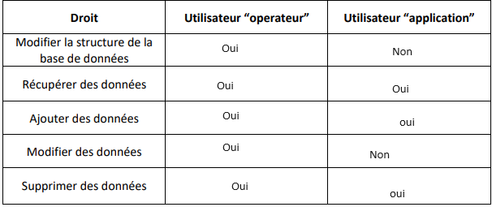

# Instalation d'une vm

### 2.1  On va faire 2 réseaux un qui sera privé en réseau uniquement pour le host et un public en NAT, cela permettra que la base de données soit dispo à tout le monde la voulant 
--
### 2.2  
Voici une reformulation plus claire et concise :  

---

### 1. Préparation de la machine virtuelle  
- Créez une nouvelle machine virtuelle dans votre logiciel de virtualisation préféré (par exemple, VirtualBox).  
- Configurez les ressources :  
  - **RAM** : 1 Go ou plus.  
  - **Processeur** : 1 cœur.  
  - **Disque dur** : 10 Go.  
- Cochez l’option "Skip" pour éviter de télécharger une machine virtuelle préexistante.  

---

### 2. Lancement de l’installation  
- Démarrez la machine virtuelle.  
- Choisissez **"plus d'options"** puis **"expert"**.  
- Sélectionnez la langue (*Français*), le pays et le type de clavier.  

---

### 3. Détection et configuration du réseau  
- L’installation détectera automatiquement le matériel réseau.  
- Optez pour **DHCP** pour une configuration automatique.  

---

### 4. Configuration des comptes utilisateurs  
- Ne configurez pas de compte superutilisateur (root) pour activer le mode *sudo* par défaut.  
- Créez un utilisateur normal avec les paramètres suivants :  
  - **Nom complet** : opérateur.  
  - **Nom d’utilisateur** : operateur.  
  - **Mot de passe sécurisé** : operateur.  

---

### 5. Configuration des partitions  
- Choisissez un partitionnement automatique ou manuel :  
  - Pour une configuration simple, sélectionnez **"Utiliser tout le disque"**.  
  - Si nécessaire, utilisez LVM ou créez des partitions séparées pour `/home`, `/var`, etc.  

---

### 6. Installation du système de base  
- Validez le miroir Debian suggéré pour télécharger les paquets nécessaires.  
- Acceptez les options par défaut jusqu’à la fin de l’étape.  

---

### 7. Configuration de l’outil de gestion de paquets  
- Sélectionnez un miroir proche de votre emplacement géographique.  
- Désactivez les mises à jour automatiques en répondant **"Non"**.  

---

### 8. Choix et installation des logiciels  
- Ne sélectionnez pas d’environnement de bureau pour une installation sans interface graphique.  
- Cochez uniquement :  
  - **Utilitaires standard du système**.  
  - **Serveur SSH** (si un accès distant est nécessaire).  

---

### 9. Installation du programme de démarrage GRUB  
- Installez GRUB sur le disque principal.  
- Vérifiez que Debian est configuré comme système par défaut.  

---

---

### 2.6 Il faut faire un sudo, si une personne récupère le mot de passe elle peut avoir tout les droits.
--
### 2.7 

--
### 2.8 

--
### 2.9
- sudo apt install openssh-server
- sudo systemctl status ssh
- sudo systemctl start ssh
- sudo systemctl enable ssh
----
### 2.10

--
### 2.11

Nous ne pouvons pas le faire car nous n'avons pas l'autorisation, il faut créer un utilisateur pour l'administration

---
### 2.12 

L'inconveniant est que tout le monde peut y acceder et donc ce n'est pas sécurisé

---
### 2.13
CREATE USER 'operateur'@'192.168.56.%' IDENTIFIED BY 'jaienviedeff';

CREATE USER 'application'@'%' IDENTIFIED BY 'application';
 

---
# Préparation de la base de données 

### 3.3
Je ne peux rien faire

---
### 3.4

---

### 3.5

GRANT ALL PRIVILEGES ON rpgquest.* TO 'operateur'@'192.168.56.%';

---
### 3.6

GRANT SELECT, INSERT, DELETE ON rpgquest.* TO 'application'@'%';

---
# Import de la base de données

### 4.1
 J'ai utilisé filezila pour envoyer le fichier sur ma vm puis
- mysql -u operateur -p rpgquest < /home/operateur/RPGQuest.sql
- puis j'ai vérifié avec :
- mysql -u operateur -p
- USE rpgquest;
- SHOW TABLES;

### 4.2 
